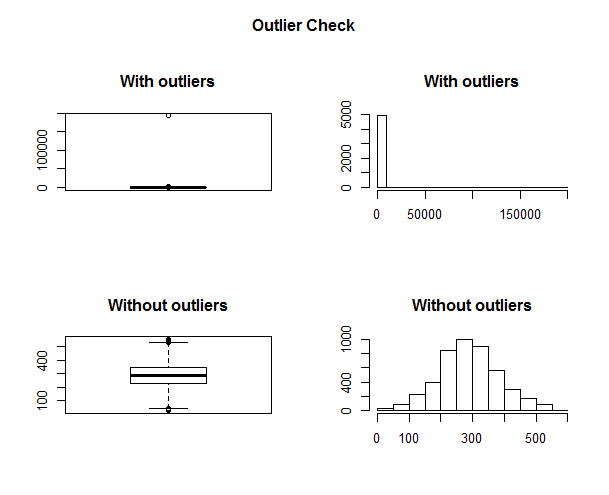

# Sales Data for Staten Island
Thangam, Preeti, Ekaterina  
March 1, 2017  
##Steps to create tidy data
###1. Read and check the raw data

```r
#read file with raw data
bk <- read.csv("Data/rollingsales_statenisland.csv",skip=4,header=TRUE)

## Check the data
head(bk)
```

```
##   BOROUGH NEIGHBORHOOD                       BUILDING.CLASS.CATEGORY
## 1       5    ANNADALE   01 ONE FAMILY DWELLINGS                     
## 2       5    ANNADALE   01 ONE FAMILY DWELLINGS                     
## 3       5    ANNADALE   01 ONE FAMILY DWELLINGS                     
## 4       5    ANNADALE   01 ONE FAMILY DWELLINGS                     
## 5       5    ANNADALE   01 ONE FAMILY DWELLINGS                     
## 6       5    ANNADALE   01 ONE FAMILY DWELLINGS                     
##   TAX.CLASS.AT.PRESENT BLOCK LOT EASE.MENT BUILDING.CLASS.AT.PRESENT
## 1                   1   5391   9        NA                       A5 
## 2                   1   5391  30        NA                       A1 
## 3                   1   5395  15        NA                       A1 
## 4                   1   5397  60        NA                       A1 
## 5                   1   5399  26        NA                       A1 
## 6                   1   5406  37        NA                       A1 
##                ADDRESS APARTMENT.NUMBER ZIP.CODE RESIDENTIAL.UNITS
## 1     4726 AMBOY ROAD                     10312                  1
## 2   1306 ARDEN AVENUE                     10312                  1
## 3     10 EDWIN STREET                     10312                  1
## 4   33 EYLANDT STREET                     10312                  1
## 5  235 KOCH BOULEVARD                     10312                  1
## 6  111 ELMBANK STREET                     10312                  1
##   COMMERCIAL.UNITS TOTAL.UNITS LAND.SQUARE.FEET GROSS.SQUARE.FEET
## 1                0           1             3067               910
## 2                0           1             7500              1890
## 3                0           1             7000              2200
## 4                0           1            10120              3516
## 5                0           1             9555              1528
## 6                0           1             2500              1200
##   YEAR.BUILT TAX.CLASS.AT.TIME.OF.SALE BUILDING.CLASS.AT.TIME.OF.SALE
## 1       2002                         1                            A5 
## 2       1952                         1                            A1 
## 3       1980                         1                            A1 
## 4       1984                         1                            A1 
## 5       1960                         1                            A1 
## 6       1999                         1                            A1 
##   SALE.PRICE SALE.DATE
## 1    520000      42481
## 2         0      42494
## 3        10      42481
## 4         0      42592
## 5         0      42411
## 6    520000      42454
```

```r
summary(bk)
```

```
##     BOROUGH                     NEIGHBORHOOD 
##  Min.   :    5.0    GREAT KILLS       : 729  
##  1st Qu.:    5.0    NEW SPRINGVILLE   : 462  
##  Median :    5.0    MIDLAND BEACH     : 356  
##  Mean   :  626.8    BULLS HEAD        : 341  
##  3rd Qu.:    5.0    ELTINGVILLE       : 319  
##  Max.   :42759.0    WEST NEW BRIGHTON : 312  
##                    (Other)            :5695  
##                                   BUILDING.CLASS.CATEGORY
##   01 ONE FAMILY DWELLINGS                     :4632      
##   02 TWO FAMILY DWELLINGS                     :1843      
##   04 TAX CLASS 1 CONDOS                       : 474      
##   05 TAX CLASS 1 VACANT LAND                  : 350      
##   13 CONDOS - ELEVATOR APARTMENTS             : 168      
##                                               : 120      
##  (Other)                                      : 627      
##  TAX.CLASS.AT.PRESENT     BLOCK           LOT         EASE.MENT     
##   1     :6492         Min.   :   1   Min.   :   1.0   Mode:logical  
##   1A    : 470         1st Qu.:1147   1st Qu.:  23.0   NA's:8214     
##   1B    : 401         Median :3154   Median :  52.0                 
##   4     : 325         Mean   :3360   Mean   : 183.6                 
##   2     : 317         3rd Qu.:5420   3rd Qu.: 120.0                 
##         : 120         Max.   :8050   Max.   :5357.0                 
##  (Other):  89         NA's   :120    NA's   :120                    
##  BUILDING.CLASS.AT.PRESENT                   ADDRESS     APARTMENT.NUMBER
##   A5    :1742                                    : 120          :7549    
##   A1    :1297               100 COLFAX AVENUE    :  23          : 120    
##   B2    :1162               2 ELMWOOD PARK DRIVE :  18    A     :  14    
##   A2    : 948               145 LINCOLN AVENUE   :  17    1B    :   9    
##   R3    : 470               1000 CLOVE ROAD      :  10    2B    :   9    
##   V0    : 393               5 WINDHAM LOOP       :  10    2C    :   9    
##  (Other):2202              (Other)               :8016   (Other): 504    
##     ZIP.CODE    RESIDENTIAL.UNITS COMMERCIAL.UNITS    TOTAL.UNITS     
##   10314 :1428   Min.   :    0     Min.   : 0.00000   Min.   :  0.000  
##   10306 :1090   1st Qu.:    1     1st Qu.: 0.00000   1st Qu.:  1.000  
##   10312 :1079   Median :    1     Median : 0.00000   Median :  1.000  
##   10305 : 703   Mean   :  154     Mean   : 0.05869   Mean   :  1.322  
##   10309 : 609   3rd Qu.:    2     3rd Qu.: 0.00000   3rd Qu.:  2.000  
##   10304 : 580   Max.   :10314     Max.   :18.00000   Max.   :362.000  
##  (Other):2725   NA's   :120       NA's   :120        NA's   :120      
##  LAND.SQUARE.FEET  GROSS.SQUARE.FEET   YEAR.BUILT  
##  Min.   :      0   Min.   :     0    Min.   :   0  
##  1st Qu.:   2089   1st Qu.:  1000    1st Qu.:1931  
##  Median :   3365   Median :  1439    Median :1970  
##  Mean   :   5997   Mean   :  1767    Mean   :1813  
##  3rd Qu.:   4890   3rd Qu.:  2042    3rd Qu.:1989  
##  Max.   :4252327   Max.   :326646    Max.   :2016  
##  NA's   :120       NA's   :120       NA's   :120   
##  TAX.CLASS.AT.TIME.OF.SALE BUILDING.CLASS.AT.TIME.OF.SALE    SALE.PRICE  
##  Min.   :   1.00            A5    :1808                    0      :2226  
##  1st Qu.:   1.00            A1    :1315                           : 120  
##  Median :   1.00            B2    :1175                    10     : 101  
##  Mean   :  30.31            A2    : 939                    550000 :  69  
##  3rd Qu.:   1.00            R3    : 471                    C6     :  68  
##  Max.   :2000.00            B9    : 376                    350000 :  62  
##  NA's   :120               (Other):2130                   (Other) :5568  
##    SALE.DATE     
##  Min.   :     0  
##  1st Qu.: 42493  
##  Median : 42579  
##  Mean   : 44165  
##  3rd Qu.: 42660  
##  Max.   :417000  
##  NA's   :120
```

```r
str(bk)
```

```
## 'data.frame':	8214 obs. of  21 variables:
##  $ BOROUGH                       : num  5 5 5 5 5 5 5 5 5 5 ...
##  $ NEIGHBORHOOD                  : Factor w/ 59 levels ""," ANNADALE ",..: 2 2 2 2 2 2 2 2 2 2 ...
##  $ BUILDING.CLASS.CATEGORY       : Factor w/ 32 levels ""," 01 ONE FAMILY DWELLINGS                     ",..: 2 2 2 2 2 2 2 2 2 2 ...
##  $ TAX.CLASS.AT.PRESENT          : Factor w/ 11 levels "","   "," 1 ",..: 3 3 3 3 3 3 3 3 3 3 ...
##  $ BLOCK                         : num  5391 5391 5395 5397 5399 ...
##  $ LOT                           : num  9 30 15 60 26 37 7 24 69 4 ...
##  $ EASE.MENT                     : logi  NA NA NA NA NA NA ...
##  $ BUILDING.CLASS.AT.PRESENT     : Factor w/ 90 levels "","   "," A0 ",..: 7 4 4 4 4 4 5 7 7 7 ...
##  $ ADDRESS                       : Factor w/ 7400 levels ""," 1 BOLIVAR STREET ",..: 5038 795 24 3686 2554 402 1920 6490 1944 3912 ...
##  $ APARTMENT.NUMBER              : Factor w/ 329 levels ""," ","   "," 02B ",..: 3 3 3 3 3 3 3 3 3 3 ...
##  $ ZIP.CODE                      : Factor w/ 17 levels "","   "," 0 ",..: 14 14 14 14 14 14 14 14 14 14 ...
##  $ RESIDENTIAL.UNITS             : num  1 1 1 1 1 1 1 1 1 1 ...
##  $ COMMERCIAL.UNITS              : num  0 0 0 0 0 0 0 0 0 0 ...
##  $ TOTAL.UNITS                   : num  1 1 1 1 1 1 1 1 1 1 ...
##  $ LAND.SQUARE.FEET              : num  3067 7500 7000 10120 9555 ...
##  $ GROSS.SQUARE.FEET             : num  910 1890 2200 3516 1528 ...
##  $ YEAR.BUILT                    : num  2002 1952 1980 1984 1960 ...
##  $ TAX.CLASS.AT.TIME.OF.SALE     : num  1 1 1 1 1 1 1 1 1 1 ...
##  $ BUILDING.CLASS.AT.TIME.OF.SALE: Factor w/ 89 levels ""," 1 "," 2 ",..: 8 5 5 5 5 5 6 8 8 8 ...
##  $ SALE.PRICE                    : Factor w/ 1586 levels ""," 0 "," 1 ",..: 1037 2 4 2 2 1037 449 806 1148 2 ...
##  $ SALE.DATE                     : num  42481 42494 42481 42592 42411 ...
```
###2. Set all variable names to low case for easy use.

```r
names(bk) <- tolower(names(bk))
```
###3. We need to remove not actual sales. Sales with missing values.

```r
bk$sale.price.n <- as.numeric(gsub("[^[:digit:]]","", bk$sale.price))
bk$gross.sqft <- as.numeric(gsub("[^[:digit:]]","", bk$gross.square.feet))
bk$land.sqft <- as.numeric(gsub("[^[:digit:]]","", bk$land.square.feet))
bk$years.built <- as.numeric(as.character(bk$year.built))
```
###4. Then we create a set without missing values

```r
#create dataset with actual sales
cs=subset(bk,bk$sale.price.n>0&bk$gross.sqft>0&bk$land.sqft>0&bk$year.built>0)
```
###5. We need to remove columns that are a duplicat of our tidy columns

```r
cs$sale.price=NULL
cs$gross.square.feet=NULL
cs$land.square.feet=NULL
cs$year.built=NULL
```
###6. We need to check for not actual sales. 
####The best way to check it with data given is remove outliers from ratio sale price to gross square fit. It will remove 1$ sales or really weird sales.

```r
#checking for outliers and decaiding what to do with them 
#this code is taken from https://www.r-bloggers.com/identify-describe-plot-and-remove-the-outliers-from-the-dataset/
outlierKD <- function(dt, var) {
  var_name <- eval(substitute(var),eval(dt))
  na1 <- sum(is.na(var_name))
  m1 <- mean(var_name, na.rm = T)
  par(mfrow=c(2, 2), oma=c(0,0,3,0))
  boxplot(var_name, main="With outliers")
  hist(var_name, main="With outliers", xlab=NA, ylab=NA)
  outlier <- boxplot.stats(var_name)$out
  mo <- mean(outlier)
  var_name <- ifelse(var_name %in% outlier, NA, var_name)
  boxplot(var_name, main="Without outliers")
  hist(var_name, main="Without outliers", xlab=NA, ylab=NA)
  title("Outlier Check", outer=TRUE)
  na2 <- sum(is.na(var_name))
  cat("Outliers identified:", na2 - na1, "n")
  cat("Propotion (%) of outliers:", round((na2 - na1) / sum(!is.na(var_name))*100, 1), "n")
  cat("Mean of the outliers:", round(mo, 2), "n")
  m2 <- mean(var_name, na.rm = T)
  cat("Mean without removing outliers:", round(m1, 2), "n")
  cat("Mean if we remove outliers:", round(m2, 2), "n")
  dt[as.character(substitute(var))] <- invisible(var_name)
  assign(as.character(as.list(match.call())$dt), dt, envir = .GlobalEnv)
  cat("Outliers successfully removed", "n")
  return(invisible(dt))
}


#apply this function until we get 0% proportion. This way we will get meaningful dataset.
cs$cs.pricePERsqft=cs$sale.price.n/cs$gross.sqft
outlierKD(cs,cs.pricePERsqft)
```

<!-- -->

```
## Outliers identified: 300 nPropotion (%) of outliers: 6.5 nMean of the outliers: 979.92 nMean without removing outliers: 330.96 nMean if we remove outliers: 288.76 nOutliers successfully removed n
```
###7.Creating clean set without "NA" in place of outliers

```r
cleanset=subset(cs,!is.na(cs$cs.pricePERsqft))
```
###8. The last step is to save clean dataset

```r
#create csv with clean data
write.csv(cleanset,file='Data/CleanedSalesData.csv')
```
