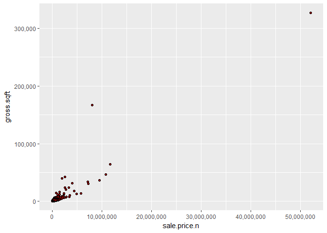
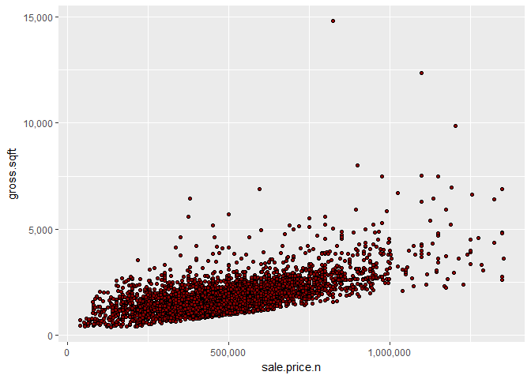
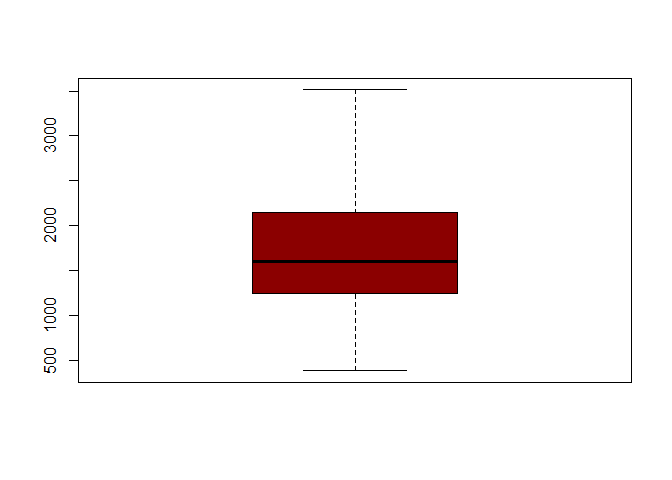
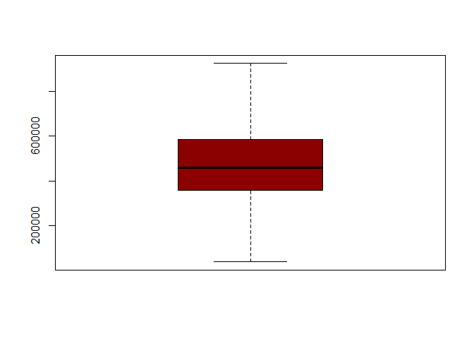
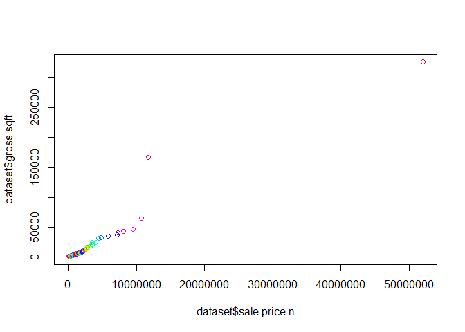
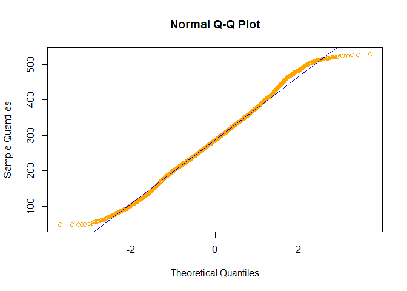
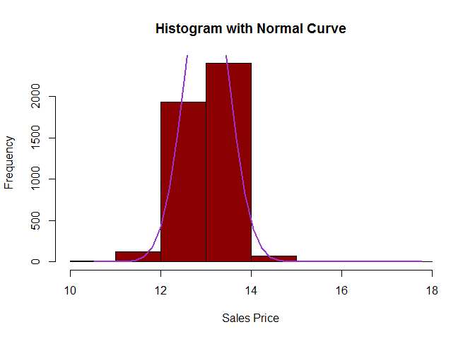
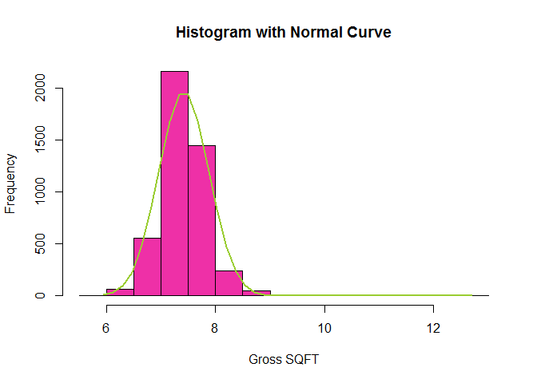
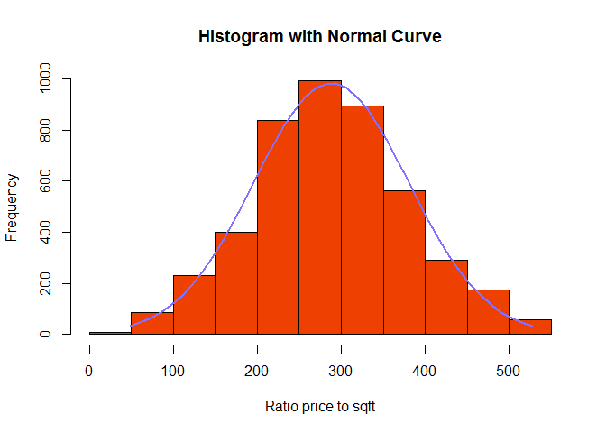

# Sales Data for Staten Island
Thangam, Preeti, Ekaterina  
March 1, 2017  

####Here are some meaningful patterns in the dataset:
#####1.	50% of the sale prices are between 37100 and 585000 as indicated by the boxplot
#####2.	50% of the gross square footage is between 1242 and 2150 as indicated by the boxplot
#####3.	Most of the properties are less than 50000 in gross sqft with a few properties greater than 50000 in gross sqft.
#####4.	Only 2140 are 1,2,3 family homes as given by the dim(bk) command. The rest are other types of properties like land, apartments and other types.
#####5.There is moderate positive correlation between sales price and gross square footage as indicated by correlation coefficient. Which is expected as different building types were used for analysis.
#####6.The ratio of price to square footage is normally distributed as it's seen on a normal qq-plot.
#####7.Most of the sale prices is before 1 million and most of the gross square footage is less than 5000 sqft.


```r
library(ggplot2)
library(sm)
```

```
## Package 'sm', version 2.2-5.4: type help(sm) for summary information
```


```r
library(scales)
#upload clean dataset
dataset <- read.csv("CleanedSalesData.csv",header=TRUE)
summary(dataset)
```

```
##        X           borough               neighborhood 
##  Min.   :   6   Min.   :5    GREAT KILLS       : 453  
##  1st Qu.:2072   1st Qu.:5    ARDEN HEIGHTS     : 195  
##  Median :4210   Median :5    ELTINGVILLE       : 195  
##  Mean   :4144   Mean   :5    MIDLAND BEACH     : 191  
##  3rd Qu.:6340   3rd Qu.:5    WEST NEW BRIGHTON : 188  
##  Max.   :8213   Max.   :5    BULLS HEAD        : 182  
##                             (Other)            :3137  
##                                   building.class.category
##   01 ONE FAMILY DWELLINGS                     :3146      
##   02 TWO FAMILY DWELLINGS                     :1204      
##   03 THREE FAMILY DWELLINGS                   :  45      
##   22 STORE BUILDINGS                          :  41      
##   21 OFFICE BUILDINGS                         :  28      
##   07 RENTALS - WALKUP APARTMENTS              :  24      
##  (Other)                                      :  53      
##  tax.class.at.present     block           lot         ease.ment     
##   1  :4399            Min.   :   5   Min.   :  1.00   Mode:logical  
##   2  :   5            1st Qu.:1144   1st Qu.: 23.00   NA's:4541     
##   2A :  27            Median :3335   Median : 49.00                 
##   2B :   5            Mean   :3471   Mean   : 79.44                 
##   4  : 105            3rd Qu.:5494   3rd Qu.:100.00                 
##                       Max.   :8050   Max.   :797.00                 
##                                                                     
##  building.class.at.present                   address     apartment.number
##   A5    :1325               21 GREAVES COURT     :   3   Min.   :10      
##   A1    : 920               10 JOSEPH COURT      :   2   1st Qu.:31      
##   B2    : 760               1045 SHELDON AVENUE  :   2   Median :52      
##   A2    : 515               106 BLACKFORD AVENUE :   2   Mean   :52      
##   B9    : 257               11 CURTIS COURT      :   2   3rd Qu.:73      
##   A9    : 212               118 ST MARYS AVENUE  :   2   Max.   :94      
##  (Other): 552              (Other)               :4528   NA's   :4538    
##     zip.code     residential.units commercial.units   total.units     
##  Min.   :    0   Min.   :  0.000   Min.   : 0.0000   Min.   :  0.000  
##  1st Qu.:10305   1st Qu.:  1.000   1st Qu.: 0.0000   1st Qu.:  1.000  
##  Median :10308   Median :  1.000   Median : 0.0000   Median :  1.000  
##  Mean   :10288   Mean   :  1.392   Mean   : 0.0577   Mean   :  1.448  
##  3rd Qu.:10312   3rd Qu.:  2.000   3rd Qu.: 0.0000   3rd Qu.:  2.000  
##  Max.   :10314   Max.   :361.000   Max.   :12.0000   Max.   :362.000  
##                                                                       
##  tax.class.at.time.of.sale building.class.at.time.of.sale   sale.date    
##  Min.   :1.000              A5    :1340                   Min.   :42401  
##  1st Qu.:1.000              A1    : 918                   1st Qu.:42500  
##  Median :1.000              B2    : 757                   Median :42583  
##  Mean   :1.078              A2    : 513                   Mean   :42579  
##  3rd Qu.:1.000              B9    : 258                   3rd Qu.:42661  
##  Max.   :4.000              A9    : 200                   Max.   :42759  
##                            (Other): 555                                  
##   sale.price.n        gross.sqft       land.sqft       years.built  
##  Min.   :   37100   Min.   :   382   Min.   :   315   Min.   :1865  
##  1st Qu.:  357500   1st Qu.:  1242   1st Qu.:  2380   1st Qu.:1940  
##  Median :  460000   Median :  1600   Median :  3400   Median :1975  
##  Mean   :  524775   Mean   :  2015   Mean   :  4478   Mean   :1968  
##  3rd Qu.:  585000   3rd Qu.:  2150   3rd Qu.:  4750   3rd Qu.:1995  
##  Max.   :52000000   Max.   :326646   Max.   :997959   Max.   :2016  
##                                                                     
##  cs.pricePERsqft 
##  Min.   : 48.34  
##  1st Qu.:226.22  
##  Median :286.38  
##  Mean   :288.09  
##  3rd Qu.:346.96  
##  Max.   :527.50  
## 
```


```r
#plot sale price vs sqft

ggplot(dataset) + geom_point(data=dataset,aes(x=sale.price.n,
                                              y=gross.sqft), fill="DarkRed", shape=21)+scale_x_continuous(labels = comma)+scale_y_continuous(labels=comma)
```

<!-- -->


```r
#correlation coefficient
cor(dataset$gross.sqft,dataset$sale.price.n)
```

```
## [1] 0.922483
```


```r
#reduced dataset. To see data claster closer
newset=subset(dataset,dataset$sale.price.n<1400000)
ggplot(dataset) + geom_point(data=newset,aes(x=sale.price.n,
                                             y=gross.sqft), fill="DarkRed", shape=21)+scale_x_continuous(labels = comma)+scale_y_continuous(labels = comma)
```

<!-- -->


```r
#correlation coeficcient realy sensitive to outliers
cor(newset$gross.sqft,newset$sale.price.n)
```

```
## [1] 0.6422756
```


```r
#boxplots
options(scipen=10000)
boxplot(dataset$gross.sqft,outline=FALSE,col="DarkRed", names="SQFT")
```

<!-- -->


```r
boxplot(dataset$sale.price.n,outline=FALSE,col="DarkRed",names="Sale price")
```

<!-- -->


```r
#qqplot of price to sqft
qqplot(x=dataset$sale.price.n,y=dataset$gross.sqft,col=rainbow(20))
```

<!-- -->


```r
#normal qqplot for ratio price to sqft
qqnorm(dataset$cs.pricePERsqft,col="Orange")
qqline(dataset$cs.pricePERsqft,col="Blue")
```

<!-- -->


```r
#hist with density curve Taken from http://www.statmethods.net/graphs/density.html
#because outlier drags to a high right scew logarithmic transformation was used
param.sale=log(dataset$sale.price.n)
h<-hist(param.sale, breaks=10, col="darkred", xlab="Sales Price", 
        main="Histogram with Normal Curve") 
xfit<-seq(min(param.sale),max(param.sale),length=40) 
yfit<-dnorm(xfit,mean=mean(param.sale),sd=sd(param.sale)) 
yfit <- yfit*diff(h$mids[1:2])*length(param.sale) 
lines(xfit, yfit, col="darkorchid3", lwd=2)
```

<!-- -->


```r
#because outlier drags to a high right scew logarithmic transformation was used
param.gross=log(dataset$gross.sqft)
h<-hist(param.gross, breaks=10, col="maroon2", xlab="Gross SQFT", 
        main="Histogram with Normal Curve") 
xfit<-seq(min(param.gross),max(param.gross),length=40) 
yfit<-dnorm(xfit,mean=mean(param.gross),sd=sd(param.gross)) 
yfit <- yfit*diff(h$mids[1:2])*length(param.gross) 
lines(xfit, yfit, col="yellowgreen", lwd=2)
```

<!-- -->


```r
#histogram with density curve for ratio price to sqft
#there is not need in logarithmic transformation
param.PriceSQFT=dataset$cs.pricePERsqft
h<-hist(param.PriceSQFT, breaks=10, col="orangered2", xlab="Ratio price to sqft", 
        main="Histogram with Normal Curve") 
xfit<-seq(min(param.PriceSQFT),max(param.PriceSQFT),length=40) 
yfit<-dnorm(xfit,mean=mean(param.PriceSQFT),sd=sd(param.PriceSQFT)) 
yfit <- yfit*diff(h$mids[1:2])*length(param.PriceSQFT) 
lines(xfit, yfit, col="lightslateblue", lwd=2)
```

<!-- -->

